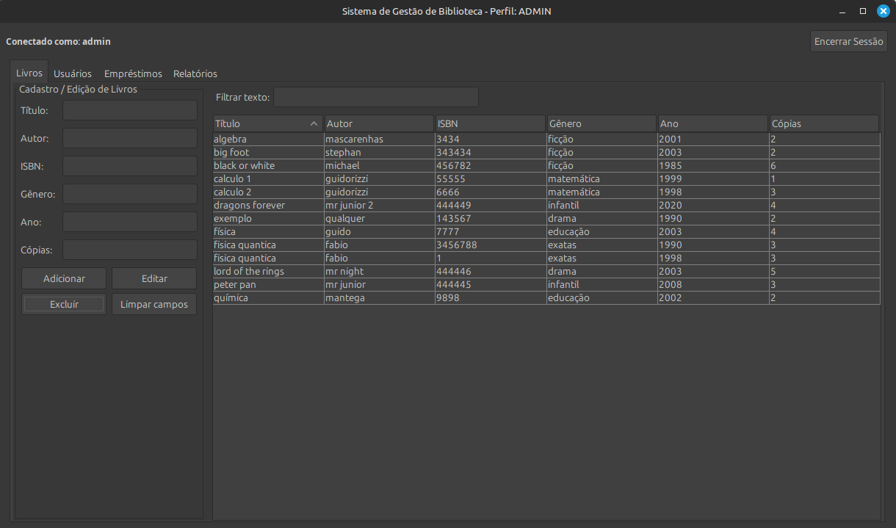
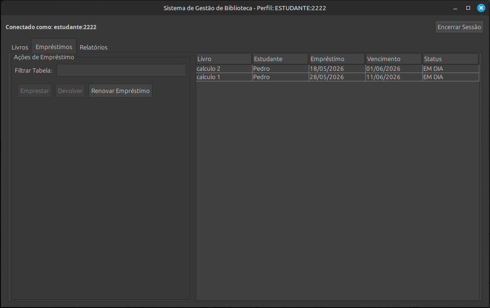
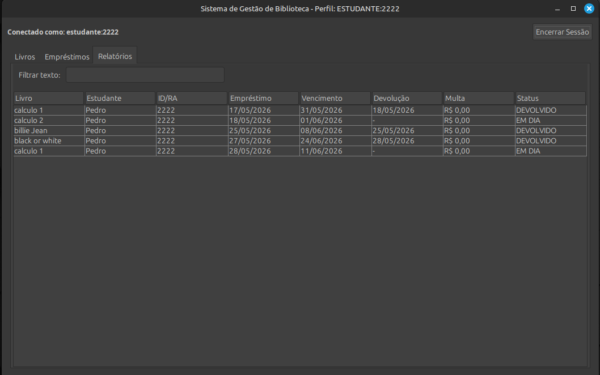
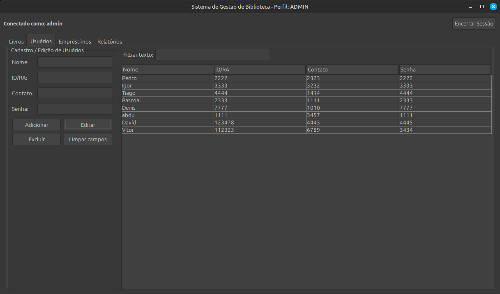
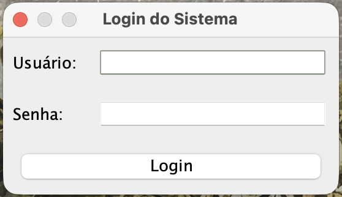
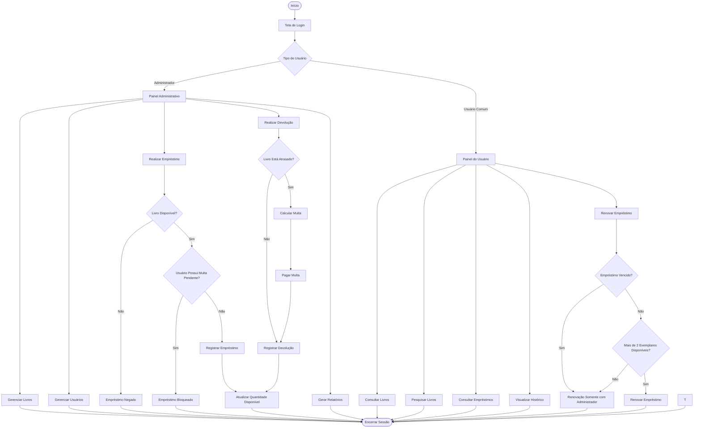

# 📚 JavaLibrary - Sistema de Gerenciamento de Biblioteca


---

# 📖 Sobre o Projeto

O **JavaLibrary** é um sistema de gerenciamento de biblioteca desenvolvido em **Java** utilizando **Swing** para a construção da interface gráfica.

O projeto foi desenvolvido com foco na aplicação prática dos principais conceitos de **Programação Orientada a Objetos (POO)**, além da organização de interfaces gráficas, persistência de dados e controle de funcionalidades por permissões de usuário.

O sistema permite o gerenciamento de:

- 📚 Livros
- 👨‍🎓 Usuários
- 🔄 Empréstimos
- 💰 Multas
- 📊 Relatórios
- 🔐 Controle de acesso

---

# 👨‍💻 Integrantes

| Nome | NUSP |
|---|---|
| André Marcelino Watanabe | 14558311 |
| Pedro Henrique Tambara Zanutto | 15656517 |
| Isaac Ferreira | 15637912 |

---

# 🖥️ Interfaces do Sistema

A interface do sistema foi desenvolvida utilizando **Java Swing**, organizada em abas e painéis separados para facilitar a navegação e melhorar a experiência do usuário.

Os mockups abaixo representam as principais telas do sistema.

---

# 📷 Mockups das Interfaces do Sistema

## 📚 Tela de Gerenciamento de Livros



---

## 🔄 Tela de Empréstimos



---

## 📊 Tela de Relatórios



---

## 👨‍🎓 Tela de Usuários



---

## 🔐 Tela de Login



---

## 📖 Tela de Histórico de Empréstimos


---


# 🚀 Funcionalidades Principais

## 📚 Gestão de Livros

- Cadastro de livros
- Edição de livros
- Exclusão de livros
- Controle de quantidade de exemplares
- Busca por:
  - Título
  - Autor
  - ISBN
  - Gênero

---

## 👨‍🎓 Gestão de Usuários

- Cadastro de usuários
- Edição de usuários
- Exclusão de usuários
- Busca por:
  - Nome
  - ID/RA

---

## 🔄 Sistema de Empréstimos

- Empréstimos com prazo automático de **14 dias**
- Controle de disponibilidade de exemplares
- Renovação de empréstimos antes do vencimento
- Devolução de livros
- Atualização automática da disponibilidade
- Histórico completo de empréstimos

---

## 💰 Sistema de Multas

- Cálculo automático de multas
- Controle de atrasos
- Valor da multa:
  - **R$ 2,00 por dia de atraso**
- Reset manual de multas pelo administrador

---

## 📊 Relatórios

O sistema possui relatórios de:

- Empréstimos ativos
- Empréstimos atrasados
- Histórico geral
- Histórico por usuário
- Empréstimos do dia

---

## 🔐 Controle de Acesso

O sistema possui dois tipos de usuários:

| Perfil | Permissões |
|---|---|
| Administrador | Controle total do sistema |
| Usuário comum | Consulta e renovação de empréstimos |

---

## 💾 Persistência de Dados

Todos os dados do sistema são armazenados utilizando serialização Java.

Arquivo utilizado:

```text
biblioteca_dados.dat
```

Isso garante que os dados permaneçam salvos mesmo após o encerramento da aplicação.

---

# 🧠 Estrutura do Projeto

## 📂 Principais Classes

| Classe | Responsabilidade |
|---|---|
| `LibraryItem` | Classe abstrata base |
| `Book` | Representa os livros |
| `Student` | Representa os usuários |
| `Loan` | Representa os empréstimos |
| `Library` | Regras de negócio |
| `DataManager` | Persistência dos dados |
| `LibraryController` | Comunicação entre interface e lógica |
| `LibraryUI` | Interface gráfica principal |
| `LoginDialog` | Tela de login |
| `Main` | Inicialização do sistema |

---

# 🛠️ Conceitos de POO Aplicados

## 1️⃣ Herança

A classe abstrata `LibraryItem` foi utilizada como base para reutilização de atributos e comportamentos comuns aos itens da biblioteca.

---

## 2️⃣ Encapsulamento

Os atributos das entidades do sistema foram protegidos utilizando modificadores `private`, permitindo acesso controlado através de métodos getters e setters.

---

## 3️⃣ Polimorfismo

Métodos sobrescritos com `@Override` permitiram adaptar comportamentos específicos para diferentes componentes do sistema.

---

## 4️⃣ Abstração

As classes representam entidades reais da biblioteca focando apenas nas características essenciais do sistema.

---

## 5️⃣ Persistência de Dados

A interface `Serializable` foi utilizada para salvar os dados do sistema em arquivos binários.

## 🔄 Fluxograma do Sistema

## 📌 Fluxo Geral de Utilização



# 🧪 Plano de Testes

## ✅ Testes Manuais

1. Entrar como administrador
2. Cadastrar livro
3. Editar livro
4. Buscar livro
5. Cadastrar usuário
6. Editar usuário
7. Buscar usuário
8. Realizar empréstimo
9. Renovar empréstimo
10. Verificar redução das cópias disponíveis
11. Realizar devolução
12. Verificar aumento das cópias disponíveis
13. Testar relatórios
14. Testar permissões de usuário
15. Reiniciar sistema e validar persistência

---

## O sistema deve:

- Cadastrar corretamente
- Buscar corretamente
- Emprestar corretamente
- Renovar corretamente
- Devolver corretamente
- Gerar relatórios corretamente
- Exibir mensagens amigáveis em entradas inválidas

---

# ⚠️ Problemas Encontrados

Durante o desenvolvimento surgiram alguns desafios importantes:

- Correção de bugs envolvendo mensagens e ações incorretas entre botões
- Organização e sincronização dos dados persistidos
- Melhor distribuição e organização dos layouts da interface
- Tratamento de erros e exceções em entradas inválidas
- Controle de permissões entre administrador e usuário comum
- Melhorias na experiência do usuário em buscas e troca de sessão

Todos os problemas foram corrigidos na versão final do sistema.

---

# 📦 Como Executar o Projeto

## ✅ Pré-requisitos

- Java JDK 17 ou superior

---

## ▶️ Compilação

```bash
javac *.java
```

---

## ▶️ Execução

```bash
java Main
```

---

# 🔐 Credenciais

| Perfil | Login | Senha |
|---|---|---|
| Administrador | `admin` | `123` |
| Usuário | `2222` | `2222` |

---

# 📂 Estrutura de Pastas Recomendada

```text
📦 JavaLibrary
 ┣ 📂 mockups
 ┃ ┣ 📜 1.png
 ┃ ┣ 📜 2.png
 ┃ ┣ 📜 3.png
 ┃ ┣ 📜 4.png
 ┃ ┣ 📜 5.png
 ┃ ┣ 📜 6.png
 ┃ ┣ 📜 7.png
 ┃ ┗ 📜 8.png
 ┣ 📜 Main.java
 ┣ 📜 Library.java
 ┣ 📜 Book.java
 ┣ 📜 Loan.java
 ┣ 📜 Student.java
 ┣ 📜 DataManager.java
 ┣ 📜 LibraryUI.java
 ┣ 📜 LibraryController.java
 ┣ 📜 LoginDialog.java
 ┣ 📜 README.md
 ┗ 📜 biblioteca_dados.dat
```

---

# 📌 Melhorias Futuras

Possíveis melhorias futuras:

- Interface mais moderna e amigável
- Sistema de reservas online
- Integração com banco de dados relacional
- Criptografia de senhas
- Exportação de relatórios em PDF
- Dashboard com gráficos estatísticos
- Notificações automáticas de atraso

---

# 📄 Licença

Projeto desenvolvido para fins acadêmicos na disciplina de Programação Orientada a Objetos.

---
