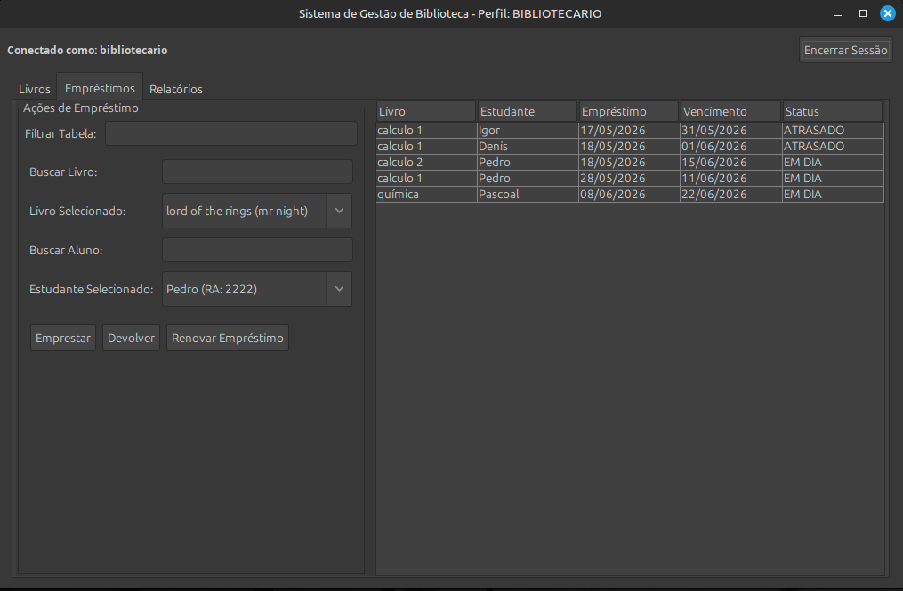
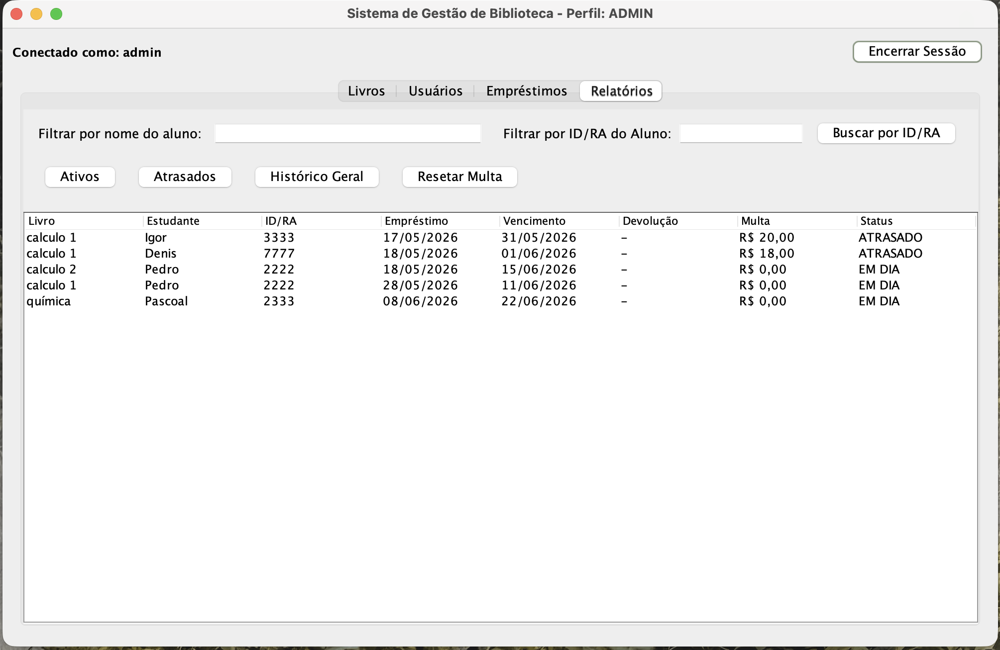
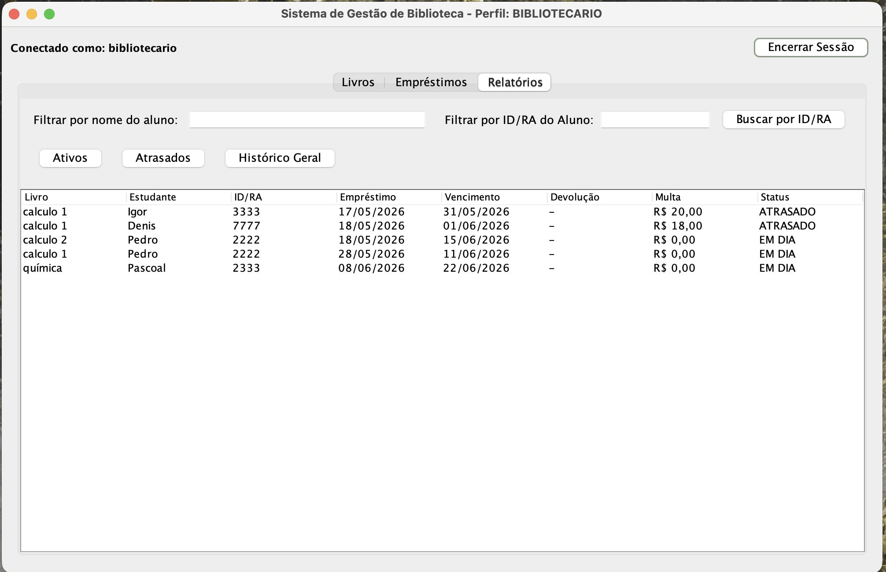
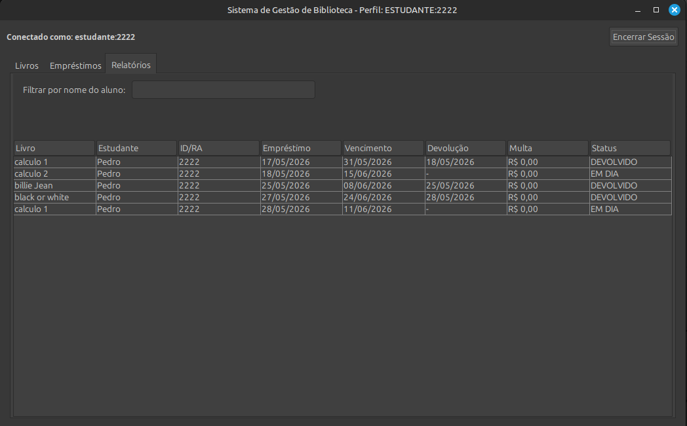
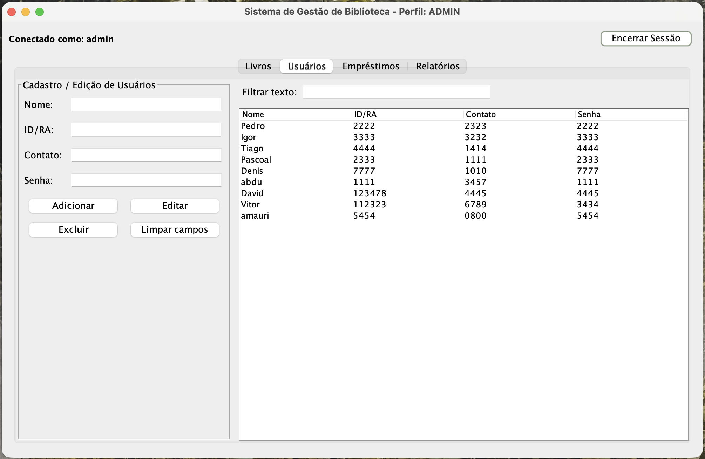
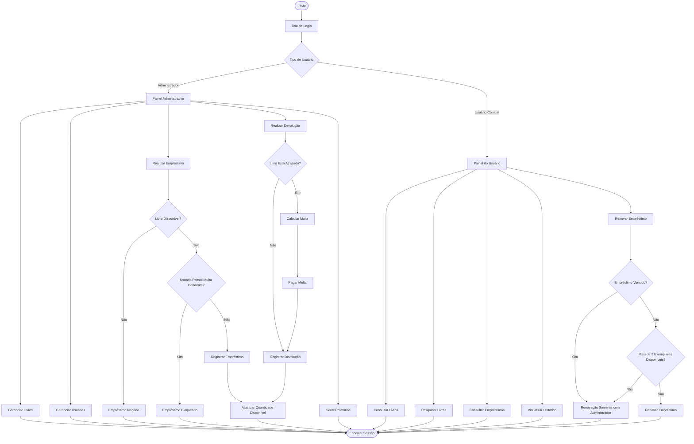

# 📚 JavaLibrary - Sistema de Gerenciamento de Biblioteca


---

# 📖 Sobre o Projeto

O **JavaLibrary** é um sistema de gerenciamento de biblioteca desenvolvido em **Java** utilizando **Swing** para a construção da interface gráfica.

O projeto foi desenvolvido com foco na aplicação prática dos principais conceitos de **Programação Orientada a Objetos (POO)**, além da organização de interfaces gráficas, persistência de dados e controle de funcionalidades por permissões de usuário.

O sistema permite o gerenciamento de:

- 📚 Livros
- 👨‍🎓 Usuários
- 🔄 Empréstimos
- 💰 Multas
- 📊 Relatórios
- 🔐 Controle de acesso

---

# 📋 Requisitos

O sistema foi desenvolvido para atender aos seguintes requisitos gerais:

- Gerenciar o acervo de livros da biblioteca;
- Gerenciar o cadastro de usuários;
- Controlar empréstimos, renovações e devoluções;
- Calcular multas por atraso;
- Gerar relatórios administrativos;
- Controlar permissões entre administradores e usuários comuns;
- Persistir os dados entre diferentes execuções do sistema.

As funcionalidades específicas que implementam esses requisitos estão descritas na seção **🚀 Funcionalidades Principais**.

---

# 👨‍💻 Integrantes

| Nome | NUSP |
|---|---|
| André Marcelino Watanabe | 14558311 |
| Pedro Henrique Tambara Zanutto | 15656517 |
| Isaac Ferreira | 15637912 |

---

# 🖥️ Interfaces do Sistema

A interface do sistema foi desenvolvida utilizando **Java Swing**, organizada em abas e painéis separados para facilitar a navegação e melhorar a experiência do usuário.

Os mockups abaixo representam as principais telas do sistema.

---
# 📷 Mockups das Interfaces do Sistema

## 📚 Tela de Gerenciamento de Livros (Admin)


---

## 🔄 Tela de Empréstimos (Bibliotecário)



---

## 🔄 Tela de Empréstimos (Estudante)


---

## 📊 Tela de Relatórios (Admin)



---

## 📊 Tela de Relatórios (Bibliotecário)



---

## 📊 Tela de Relatórios (Estudante)



---

## 👨‍🎓 Tela de Usuários (Admin)



---


# 🚀 Funcionalidades Principais

## 📚 Gestão de Livros

- Cadastro de livros
- Edição de livros
- Exclusão de livros
- Controle de quantidade de exemplares
- Busca por:
  - Título
  - Autor
  - ISBN
  - Gênero

---

## 👨‍🎓 Gestão de Usuários

- Cadastro de usuários
- Edição de usuários
- Exclusão de usuários
- Busca por:
  - Nome
  - ID/RA

---

## 🔄 Sistema de Empréstimos

- Empréstimos com prazo automático de **14 dias**
- Controle de disponibilidade de exemplares
- Renovação de empréstimos antes do vencimento
- Devolução de livros
- Atualização automática da disponibilidade
- Histórico completo de empréstimos

---

## 💰 Sistema de Multas

- Cálculo automático de multas
- Controle de atrasos
- Valor da multa:
  - **R$ 2,00 por dia de atraso**
- Reset manual de multas pelo administrador

---

## 📊 Relatórios

O sistema possui relatórios de:

- Empréstimos ativos
- Empréstimos atrasados
- Histórico geral
- Histórico por usuário
- Empréstimos do dia

---

## 🔐 Controle de Acesso

O sistema possui dois tipos de usuários:

| Perfil | Permissões |
|---|---|
| Administrador | Adiciona, edita e remove livros e usuários, redefine multas e acessa todos os relatórios |
| Bibliotecário | Realiza empréstimos, devoluções e consultas ao acervo |
| Usuário comum | Consulta livros, visualiza histórico e solicita renovação de empréstimos |
---

## 💾 Persistência de Dados

Todos os dados do sistema são armazenados utilizando serialização Java.

Arquivo utilizado:

```text
biblioteca_dados.dat

```

Durante o encerramento da aplicação, todas as alterações realizadas são automaticamente serializadas nesse arquivo. Ao iniciar novamente o sistema, os dados são restaurados, preservando livros cadastrados, usuários, empréstimos ativos, histórico e demais informações armazenadas anteriormente.


---

# 🧠 Estrutura do Projeto

## 📂 Principais Classes

| Classe | Responsabilidade |
|---|---|
| `LibraryItem` | Classe abstrata base |
| `Book` | Representa os livros |
| `Student` | Representa os usuários |
| `Loan` | Representa os empréstimos |
| `Library` | Regras de negócio |
| `DataManager` | Persistência dos dados |
| `LibraryController` | Comunicação entre interface e lógica |
| `LibraryUI` | Interface gráfica principal |
| `LoginDialog` | Tela de login |
| `Main` | Inicialização do sistema |

---

# 🛠️ Conceitos de POO Aplicados

## 1️⃣ Herança

A classe abstrata `LibraryItem` foi utilizada como base para reutilização de atributos e comportamentos comuns aos itens da biblioteca.

---

## 2️⃣ Encapsulamento

Os atributos das entidades do sistema foram protegidos utilizando modificadores `private`, permitindo acesso controlado através de métodos getters e setters.

---

## 3️⃣ Polimorfismo

Métodos sobrescritos com `@Override` permitiram adaptar comportamentos específicos para diferentes componentes do sistema.

---

## 4️⃣ Abstração

As classes representam entidades reais da biblioteca focando apenas nas características essenciais do sistema.

---

## 5️⃣ Persistência de Dados

A interface `Serializable` foi utilizada para salvar os dados do sistema em arquivos binários.

---

# 💬 Comentários sobre o código

O projeto foi organizado seguindo o princípio da separação de responsabilidades, facilitando manutenção, reutilização e futuras expansões.

A interface gráfica foi concentrada na classe `LibraryUI`, responsável por apresentar as telas e capturar as ações do usuário.

A classe `LibraryController` atua como intermediária entre a interface e a lógica de negócio, desacoplando a camada visual das regras do sistema.

As regras principais de gerenciamento da biblioteca foram implementadas na classe `Library`, responsável pelo controle dos livros, usuários, empréstimos e validações necessárias para cada operação.

A persistência dos dados é realizada pela classe `DataManager`, utilizando serialização Java para armazenar o estado completo da biblioteca em arquivo binário.

As entidades `Book`, `Student`, `Loan` e `User` representam os principais objetos do domínio da aplicação, enquanto `LibraryItem` fornece uma abstração comum para reutilização de atributos e comportamentos.

A autenticação dos usuários é realizada através da classe `LoginDialog`, permitindo diferenciar administradores e usuários comuns, cada um com permissões específicas dentro do sistema.

A arquitetura adotada busca manter baixo acoplamento entre os componentes e alta coesão dentro de cada classe, seguindo boas práticas de Programação Orientada a Objetos.

---

## 🔄 Fluxograma do Sistema

## 📌 Fluxo Geral de Utilização



# 🧪 Plano de Testes

## ✅ Testes Manuais

1. Entrar como administrador
2. Cadastrar livro
3. Editar livro
4. Buscar livro
5. Cadastrar usuário
6. Editar usuário
7. Buscar usuário
8. Entrar como bibliotecario
9. Realizar empréstimo
10. Renovar empréstimo
11. Verificar redução das cópias disponíveis
12. Realizar devolução
13. Verificar aumento das cópias disponíveis
14. Testar relatórios
15. Entrar como usuário comum
16. Testar permissões de usuário
17. Testar renovação de empréstimo como usuário comum
18. Reiniciar sistema e validar persistência
19. Verificar atrávés de botões de simulação de tempo, a lógica da aplicação de multas.
20. Verificar como o Administrador reseta a multa

---

## O sistema deve:

- Cadastrar corretamente
- Buscar corretamente
- Emprestar corretamente
- Renovar corretamente
- Devolver corretamente
- Gerar relatórios corretamente
- Exibir mensagens amigáveis em entradas inválidas

---

# ⚠️ Problemas Encontrados

Durante o desenvolvimento surgiram alguns desafios importantes:

- Correção de bugs envolvendo mensagens e ações incorretas entre botões
- Organização e sincronização dos dados persistidos
- Melhor distribuição e organização dos layouts da interface
- Tratamento de erros e exceções em entradas inválidas
- Controle de permissões entre administrador e usuário comum
- Melhorias na experiência do usuário em buscas e troca de sessão
- Desenvolvimento de mecanismos para simulação temporal durante os testes de multas e vencimentos, permitindo validar rapidamente funcionalidades que dependeriam de vários dias de execução.

---

# ✅ Test Results

Após a execução do plano de testes, verificou-se que todas as funcionalidades principais apresentaram comportamento esperado.

Os resultados obtidos foram:

| Funcionalidade | Resultado |
|---------------|-----------|
| Cadastro de livros | ✅ Sucesso |
| Edição de livros | ✅ Sucesso |
| Exclusão de livros | ✅ Sucesso |
| Busca de livros | ✅ Sucesso |
| Cadastro de usuários | ✅ Sucesso |
| Edição de usuários | ✅ Sucesso |
| Exclusão de usuários | ✅ Sucesso |
| Busca de usuários | ✅ Sucesso |
| Empréstimos | ✅ Sucesso |
| Renovação | ✅ Sucesso |
| Devolução | ✅ Sucesso |
| Atualização de exemplares | ✅ Sucesso |
| Controle de multas | ✅ Sucesso |
| Relatórios | ✅ Sucesso |
| Persistência após reinicialização | ✅ Sucesso |
| Controle de permissões | ✅ Sucesso |
| Simulação de avanço e restauração da data | ✅ Sucesso |

Durante os testes foram identificados pequenos problemas relacionados ao comportamento de alguns botões da interface, sincronização dos dados persistidos e organização visual dos componentes. Após as correções realizadas durante o desenvolvimento, o sistema apresentou funcionamento estável e consistente.

Foi verificado que os dados permanecem armazenados corretamente após o encerramento e reinicialização da aplicação, confirmando o funcionamento adequado da serialização utilizada.

Também foram utilizados os botões de simulação temporal para validar rapidamente as funcionalidades relacionadas ao vencimento dos empréstimos, cálculo de multas e bloqueio de usuários inadimplentes.

Os testes confirmaram que tanto o avanço quanto a restauração da data preservam corretamente a consistência das regras de negócio implementadas no sistema.

---

# 📦 Como Executar o Projeto

## ✅ Pré-requisitos

Antes de executar o projeto é necessário possuir:

- Java Development Kit (JDK) 17 ou superior instalado;
- Variável de ambiente `JAVA_HOME` configurada corretamente (opcional, mas recomendada);
- Terminal ou prompt de comando.

## 📥 Obtenção do Projeto

Clone o repositório utilizando:

```bash
git clone <https://github.com/andremw7/java-library-system.git>
```

Ou faça o download do projeto em formato ZIP e extraia os arquivos.

## 📂 Acesse a pasta do projeto

```bash
cd JavaLibrary
```

## ▶️ Compilação

Compile todos os arquivos Java:

```bash
javac *.java
```

## ▶️ Execução

Execute a aplicação utilizando:

```bash
java Main
```

## 🔐 Login

Após iniciar o programa, será exibida a tela de autenticação.

Utilize uma das credenciais disponíveis:

| Perfil | Login | Senha |
|---------|--------|--------|
| Administrador | `admin` | `123` |
| Bibliotecário | `bibliotecario` | `123` |
| Usuário comum | `2222` | `2222` |

Todos os dados gerados durante a utilização serão armazenados automaticamente no arquivo `biblioteca_dados.dat`, permanecendo disponíveis nas próximas execuções do sistema.---

# 📂 Estrutura de Pastas Recomendada

```text
📦 JavaLibrary
 ┣ 📂 mockups
 ┃ ┣ 📜 1.png
 ┃ ┣ 📜 2.png
 ┃ ┣ 📜 3.png
 ┃ ┣ 📜 4.png
 ┃ ┣ 📜 5.png
 ┃ ┣ 📜 6.png
 ┃ ┣ 📜 7.png
 ┃ ┗ 📜 8.png
 ┣ 📜 Main.java
 ┣ 📜 Library.java
 ┣ 📜 Book.java
 ┣ 📜 Loan.java
 ┣ 📜 Student.java
 ┣ 📜 DataManager.java
 ┣ 📜 LibraryUI.java
 ┣ 📜 LibraryController.java
 ┣ 📜 LoginDialog.java
 ┣ 📜 README.md
 ┗ 📜 biblioteca_dados.dat
```

---

# 📄 Licença

Projeto desenvolvido para fins acadêmicos na disciplina de Programação Orientada a Objetos.

---
# 📝 Comentários gerais

O desenvolvimento deste projeto permitiu aplicar de forma prática diversos conceitos estudados na disciplina de Programação Orientada a Objetos, incluindo encapsulamento, herança, abstração, polimorfismo e organização modular do código.

Além do aprendizado técnico, o trabalho proporcionou experiência no desenvolvimento colaborativo, na separação de responsabilidades entre componentes, na criação de interfaces gráficas utilizando Java Swing e na implementação de mecanismos de persistência de dados.

Outro aspecto relevante do projeto foi a implementação de ferramentas específicas para apoio aos testes, permitindo simular a passagem do tempo de forma controlada. Essa estratégia possibilitou validar corretamente regras relacionadas a atrasos, multas e vencimentos sem comprometer a lógica original da aplicação ou depender da espera do prazo real dos empréstimos.

A estrutura adotada torna o sistema facilmente expansível, permitindo futuras integrações com bancos de dados, serviços externos e novas funcionalidades sem necessidade de grandes alterações na arquitetura existente.
