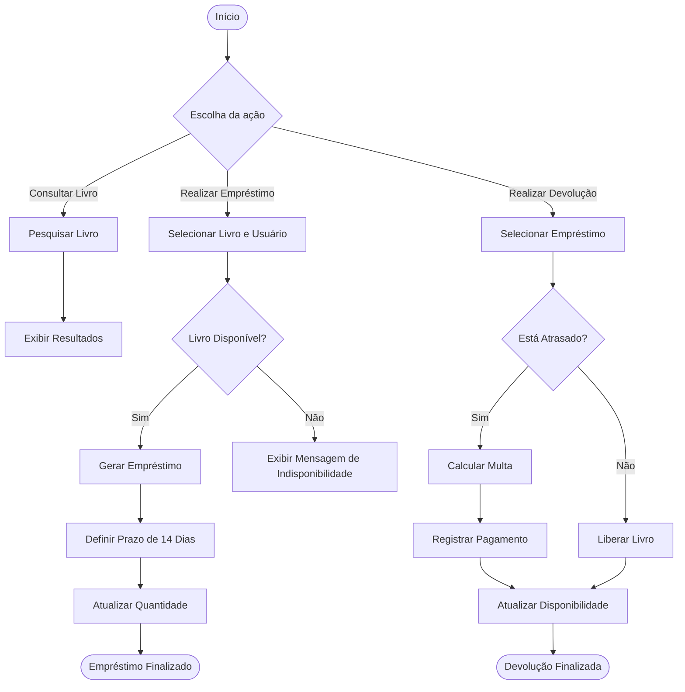

# 📚 JavaLibrary - Sistema de Gerenciamento de Biblioteca


---

# 📖 Sobre o Projeto

O **JavaLibrary** é um sistema completo de gerenciamento de biblioteca desenvolvido em **Java** utilizando **Swing** para a interface gráfica.  

O projeto foi criado com foco na aplicação prática dos conceitos de **Programação Orientada a Objetos (POO)**, incluindo:

- Herança
- Encapsulamento
- Polimorfismo
- Abstração
- Persistência de dados
- Separação entre interface e regras de negócio

O sistema permite o gerenciamento de:

- 📚 Livros
- 👨‍🎓 Usuários
- 🔄 Empréstimos
- 💰 Multas
- 📊 Relatórios
- 🔐 Controle de permissões

---

# 👨‍💻 Integrantes

| Nome | NUSP |
|---|---|
| André Marcelino Watanabe | 14558311 |
| PREENCHER | PREENCHER |
| PREENCHER | PREENCHER |

---

# 🖥️ Interface do Sistema

A interface foi desenvolvida utilizando **Java Swing**, organizada em abas e formulários separados para melhorar a experiência do usuário e evitar poluição visual na tela principal.

## 📷 Capturas de Tela

| Dashboard / Livros | Gerenciar Usuários |
| :---: | :---: |
|  |  |

| Tela de Empréstimos | Tela de Login |
| :---: | :---: |
|  |  |

> ⚠️ Substitua os caminhos acima pelas imagens reais do projeto dentro do repositório.

---

# 🚀 Funcionalidades Principais

## 📚 Gestão de Livros

- Cadastro de livros
- Edição de livros
- Exclusão de livros
- Busca por:
  - Título
  - Autor
  - ISBN
  - Gênero

---

## 👨‍🎓 Gestão de Usuários

- Cadastro de usuários
- Edição de usuários
- Exclusão de usuários
- Busca por:
  - Nome
  - ID/RA

---

## 🔄 Sistema de Empréstimos

- Empréstimos com prazo automático de **14 dias**
- Controle de disponibilidade de exemplares
- Devolução de livros
- Atualização automática da disponibilidade

---

## 💰 Sistema de Multas

- Cálculo automático de multas
- Valor:
  - **R$ 2,00 por dia de atraso**
- Verificação automática de atraso

---

## 📊 Relatórios

O sistema gera relatórios de:

- Empréstimos ativos
- Empréstimos atrasados
- Histórico por usuário
- Empréstimos do dia

---

## 🔐 Controle de Acesso

O sistema possui dois níveis de acesso:

| Perfil | Permissões |
|---|---|
| Administrador | Controle total do sistema |
| Bibliotecário | Consulta, empréstimos e devoluções |

---

## 💾 Persistência de Dados

Todos os dados são armazenados em arquivo utilizando serialização Java.

Arquivo utilizado:

```text
biblioteca_dados.dat
```

Isso garante que os dados permaneçam salvos mesmo após o fechamento da aplicação.

---

# 🧠 Estrutura do Projeto

## 📂 Principais Classes

| Classe | Responsabilidade |
|---|---|
| `LibraryItem` | Classe abstrata base |
| `Book` | Representa os livros |
| `Student` | Representa os usuários |
| `Loan` | Representa os empréstimos |
| `Library` | Regras de negócio |
| `DataManager` | Persistência dos dados |
| `LibraryController` | Comunicação entre UI e lógica |
| `LibraryUI` | Interface gráfica |
| `LoginDialog` | Tela de login |
| `Main` | Inicialização do sistema |

---

# 🛠️ Conceitos de POO Aplicados

## 1️⃣ Herança

A classe `Book` herda características da classe abstrata `LibraryItem`, permitindo reutilização de código e futura expansão para outros tipos de mídia.

---

## 2️⃣ Encapsulamento

Os atributos das classes são protegidos com modificadores `private`, sendo acessados através de getters e setters.

---

## 3️⃣ Polimorfismo

Métodos sobrescritos utilizando `@Override` permitem comportamentos específicos para diferentes entidades do sistema.

---

## 4️⃣ Abstração

As classes representam entidades reais da biblioteca focando apenas nos comportamentos essenciais.

---

## 5️⃣ Persistência com Serialização

A interface `Serializable` é utilizada para salvar objetos em arquivos binários.

---

# 🔄 Fluxograma do Sistema

## 📌 Processo de Empréstimo e Devolução



---

# 🧪 Plano de Testes

## ✅ Testes Manuais

1. Entrar como administrador
2. Cadastrar livro
3. Editar livro
4. Buscar livro
5. Cadastrar usuário
6. Editar usuário
7. Buscar usuário
8. Realizar empréstimo
9. Verificar redução das cópias disponíveis
10. Realizar devolução
11. Verificar aumento das cópias disponíveis
12. Abrir relatórios
13. Testar permissões de usuário
14. Reiniciar sistema e validar persistência

---

## 🤖 Testes Automáticos

Executar:

```bash
java TestLibrary
```

O teste valida:

- Empréstimos
- Devoluções
- Histórico
- Multas
- Prazo automático

---

# ✅ Resultados dos Testes

Resultado esperado:

```text
Todos os testes passaram.
```

O sistema deve:

- Cadastrar corretamente
- Buscar corretamente
- Emprestar corretamente
- Devolver corretamente
- Gerar relatórios corretamente
- Exibir mensagens amigáveis em entradas inválidas

---

# ⚠️ Problemas Encontrados

Durante o desenvolvimento foram encontrados alguns problemas importantes:

- Falta de busca na primeira versão
- Histórico não persistia corretamente
- Problemas na devolução de empréstimos
- Permissões não eram aplicadas corretamente
- Necessidade de separação melhor da interface

Todos os problemas foram corrigidos na versão final.

---

# 📦 Como Executar o Projeto

## ✅ Pré-requisitos

- Java JDK 17 ou superior

---

## ▶️ Compilação

```bash
javac *.java
```

---

## ▶️ Execução

```bash
java Main
```

---

# 🔐 Credenciais

| Perfil | Login | Senha |
|---|---|---|
| Administrador | `admin` | `123` |
| Bibliotecário | `user` | `123` |

---

# 📂 Estrutura de Pastas Recomendada

```text
📦 JavaLibrary
 ┣ 📂 images
 ┃ ┣ 📜 dashboard.png
 ┃ ┣ 📜 usuarios.png
 ┃ ┣ 📜 emprestimos.png
 ┃ ┗ 📜 login.png
 ┣ 📜 Main.java
 ┣ 📜 Library.java
 ┣ 📜 Book.java
 ┣ 📜 Loan.java
 ┣ 📜 Student.java
 ┣ 📜 DataManager.java
 ┣ 📜 LibraryUI.java
 ┣ 📜 LibraryController.java
 ┣ 📜 LoginDialog.java
 ┣ 📜 README.md
 ┗ 📜 biblioteca_dados.dat
```

---

# 📌 Melhorias Futuras

Possíveis melhorias futuras:

- Integração com banco de dados
- Criptografia de senhas
- Testes automatizados com JUnit
- Exportação de relatórios em PDF
- Sistema de reservas online
- Dashboard com gráficos estatísticos

---

# 📄 Licença

Projeto desenvolvido para fins acadêmicos na disciplina de Programação Orientada a Objetos.

---
